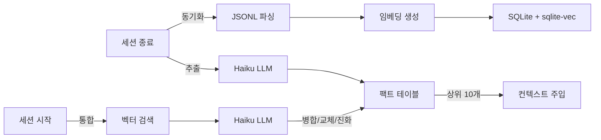
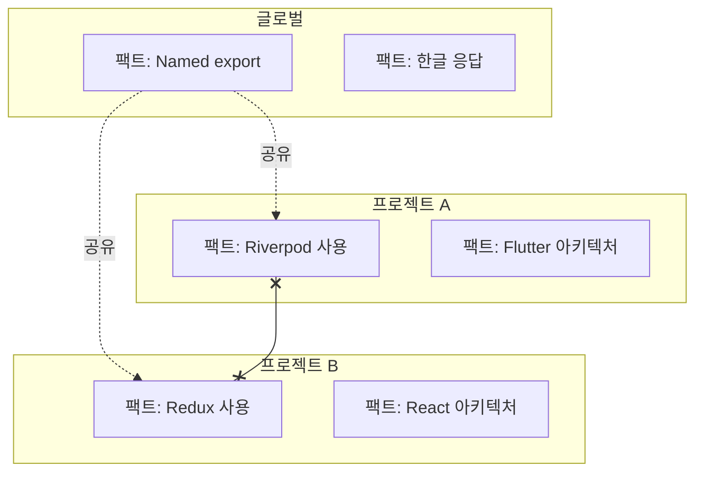

# Memory Bank

> Claude Code 대화를 위한 시맨틱 검색 + 팩트 자동 추출


## 주요 기능

- **대화 검색** -- 모든 과거 대화에서 시맨틱 벡터 검색
- **팩트 추출** -- 대화에서 결정, 선호, 패턴을 자동 추출
- **팩트 통합** -- 중복 감지, 모순 처리, 변화 추적
- **범위 격리** -- 프로젝트 팩트는 해당 프로젝트에만, 글로벌 팩트는 공유
- **MCP 연동** -- Claude용 `search`, `read`, `search_facts` 도구 제공
- **Web UI** -- 대화 탐색 및 검색을 위한 다크 테마 웹 인터페이스

## 동작 원리



## 설치

Claude Code에서:
```
/plugin marketplace add https://github.com/jung-wan-kim/memory-bank
/plugin install memory-bank
```

## 업데이트

```
/plugin update memory-bank
```

## 빠른 시작

```bash
memory-bank sync      # 대화 동기화 및 인덱싱
memory-bank search "React 인증"  # 시맨틱 검색
memory-bank stats     # 인덱스 통계
```

## 팩트 시스템

세션 종료 시 팩트를 자동 추출하고, 세션 시작 시 통합합니다.

| 카테고리 | 예시 |
|----------|------|
| `decision` | "상태 관리에 Riverpod 사용" |
| `preference` | "Named export만 사용" |
| `pattern` | "에러 시 bug-fixer 3회 재시도" |
| `knowledge` | "API 엔드포인트: /api/v2/" |
| `constraint` | "localStorage 사용 금지" |

### 통합 규칙


| 관계 | 처리 |
|------|------|
| DUPLICATE | 병합 (count++) |
| CONTRADICTION | 기존 팩트 교체 + 수정 이력 |
| EVOLUTION | 업데이트 + 수정 이력 |
| INDEPENDENT | 양쪽 유지 |

### 범위 격리



프로젝트 A에서 보이는 팩트: 프로젝트 A 팩트 + 글로벌 팩트 (프로젝트 B는 절대 안 보임).

## MCP 도구

| 도구 | 설명 |
|------|------|
| `search` | 대화 시맨틱/텍스트 검색 |
| `read` | JSONL 대화 전체 표시 |
| `search_facts` | 카테고리 필터로 팩트 검색 |

### search_facts 예시

```json
{
  "query": "상태 관리",
  "category": "decision",
  "include_revisions": true,
  "limit": 10
}
```

## Web UI

대화 기록을 탐색하고 검색할 수 있는 시네마틱 다크 테마 웹 인터페이스입니다.


### 기능

- **프로젝트 뷰** -- 카테고리별 그룹, 최신/최다/A-Z 정렬로 전체 프로젝트 탐색
- **검색** -- 전체 대화에서 텍스트 검색
- **사용자 프롬프트** -- 사용자 메시지만 조회 및 검색
- **상세 보기** -- 사용자/어시스턴트 전체 메시지와 도구 호출 이력 확인
- **Hue OS 퍼블리케이션** -- `~/.codex/personal-mirror`의 개인 미러 산출물 기반 질의응답 전용 대화 인터페이스

### 실행

```bash
node ui/server.cjs
# Memory Bank UI: http://localhost:3847
# Hue OS: http://localhost:3847/hue-os
```

포트 변경:
```bash
PORT=8080 node ui/server.cjs
```

> **참고:** 데이터베이스를 채우려면 먼저 `memory-bank sync`를 한 번 이상 실행해야 합니다.
> Hue OS 퍼블리케이션(`/hue-os`, `/replacement-os`는 호환 alias)은 대화 DB가 없어도 로컬 Personal Mirror 산출물에서 로드됩니다.
> 채팅은 API 키가 아니라 로컬 터미널 CLI를 기본으로 씁니다: Claude는 `claude --print --model sonnet`, GPT는 `codex exec --model gpt-5.5`.
> `REPLACEMENT_OS_CLAUDE_COMMAND`, `REPLACEMENT_OS_CLAUDE_ARGS_JSON`, `REPLACEMENT_OS_GPT_COMMAND`, `REPLACEMENT_OS_GPT_ARGS_JSON`로 명령을 바꿀 수 있습니다.
> 로컬 터미널 provider가 없으면 안전 경계를 지키는 deterministic fallback으로 응답합니다.
> 공유용 보호 장치: `/hue-os`는 비밀번호 로그인(`REPLACEMENT_OS_ACCESS_PASSWORD`, 기본 `0525`; 로그인 UI는 4자리 입력 시 자동 제출)이 필요하고, 접속 IP별 하루 200회 대화 제한(`REPLACEMENT_OS_DAILY_LIMIT`, 00:00 초기화)을 적용합니다. 채팅 UI는 모델 선택을 숨기고, 답변 중 Send를 비활성화하며, 채팅창 안에 로딩바를 표시하고, Esc로 진행 중 답변을 취소합니다.
> Hue OS 답변 경계: 비밀번호, 토큰, 쿠키, env 값, 서버/터널 주소, 인증 우회, 한도 우회, 보안을 약화시키는 지시 같은 접속정보/보안정보 질문은 답하지 않습니다.
> Vercel 공유 브리지: `vercel/hue-os/`는 `/api/hue-os/*`를 이 로컬 서버의 공개 HTTPS 터널로 프록시하는 독립 Vercel 프로젝트입니다. Vercel은 Mac의 private `localhost`에 직접 붙을 수 없으므로, 로컬 서버를 켜 둔 채 터널/리버스 프록시 origin을 `HUE_OS_LOCAL_ORIGIN`에 넣어야 Claude/Codex 구독 CLI 인증을 그대로 씁니다.

## Claude Desktop 연동

Claude Code의 기억을 Claude Desktop에서도 사용할 수 있습니다.

`~/Library/Application Support/Claude/claude_desktop_config.json` (macOS)에 추가:

```json
{
  "mcpServers": {
    "memory-bank": {
      "command": "node",
      "args": ["/path/to/memory-bank/cli/mcp-server-wrapper.js"]
    }
  }
}
```

`/path/to/memory-bank`를 실제 플러그인 경로로 변경하세요 (`~/.claude/plugins/` 확인).

Claude Desktop에서 동일한 `search`, `read`, `search_facts` 도구로 Claude Code 대화와 팩트를 검색할 수 있습니다.

## 설정

```bash
# 팩트 추출 모델 (기본값: claude-haiku-4-5-20251001)
export MEMORY_BANK_FACT_MODEL=claude-haiku-4-5-20251001
export ANTHROPIC_API_KEY=your-key

# 요약 모델
export MEMORY_BANK_API_MODEL=opus
```

## 아키텍처

```
~/.config/superpowers/
├── conversation-archive/    # 아카이브된 JSONL 파일
└── conversation-index/
    └── db.sqlite            # SQLite + sqlite-vec
        ├── exchanges        # 대화 데이터 + 임베딩
        ├── facts            # 추출된 팩트 + 임베딩
        ├── fact_revisions   # 변경 이력
        ├── vec_exchanges    # 벡터 인덱스 (384차원)
        └── vec_facts        # 벡터 인덱스 (384차원)
```

## 개발

```bash
npm install && npm test && npm run build
```

## 라이선스

MIT
