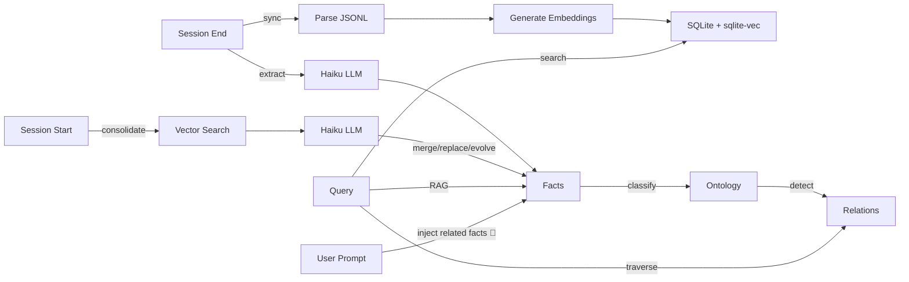
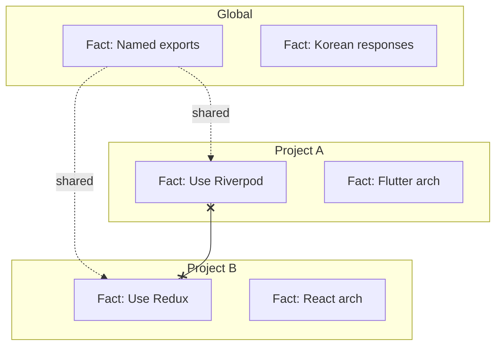

# Memory Bank

> Conversations → Knowledge Graph. Claude Code conversations become searchable, structured knowledge.


## What's New in v1.4.x

- 🧾 **Injection pipeline v2 — session dedup ledger (v1.4.0)** — a fact is now injected at most **once per session**. Before: 74% inject rate × 5.5–8 facts × ~140 chars ≈ **~470 tokens per prompt**, with the *same* facts re-injected across a session (~10k tokens per 30-prompt session). A bounded per-session ledger (400 ids, 7-day TTL, atomic writes, fail-open) filters already-injected facts; a repeated topic's 2nd occurrence injects **0 bytes** (`status:"deduped"`)
- ✂️ **Token budget** — per-fact 160-char truncation + 1,000-char block budget (lowest-relevance facts dropped first), plus an elapsed-budget gate on repeated-prompt detection: its 313k-exchange vector search (p95 498ms) is synchronous and cannot be preempted mid-flight, so it is skipped entirely when injection has already spent >700ms
- 📈 **Savings are measured, not assumed** — the inject log gains `chars` (block size) and `deduped` (facts saved) fields, so real-world token savings accumulate in observable JSONL
- 🌌 **Knowledge Galaxy (`ui/relations/`)** — Three.js 3D visualization of the ontology: 32 domains / 4.2k categories / 24.7k facts / 27.8k typed relations as a navigable galaxy — fact search, per-type edge toggles (SUPPORTS/INFLUENCES/SUPERSEDES/CONTRADICTS), relation-navigating detail panel, adaptive performance (compositor-only labels, point-size cap, eco-mode DPR). `node ui/relations/generate-data.mjs` then serve statically — the data file stays local (personal facts, gitignored)
- 🩹 **Dependency self-heal (v1.4.2)** — `claude plugin update` non-deterministically skips `npm install` for the new cache dir, and cc-sync ships plugin caches to other machines without `node_modules`. The dep-free injection thin client now detects `ERR_MODULE_NOT_FOUND` and spawns a one-shot detached `npm install` (atomic marker prevents loops), so a broken install heals itself on the first prompt
- 📦 **Packaging fix (v1.4.1)** — v1.4.0 shipped a stale committed `dist/`; the release checklist now hard-checks `git status dist/` is clean before tagging
- Earlier releases: see [CHANGELOG](CHANGELOG.md) — v1.3.x added ontology backfill batching (~25×), headless LLM spawn isolation, the classification attempt ledger, vec-index self-heal, worker flood caps, and the warm inject daemon (~2.3s → ~0.07s per prompt)

## Features

- **Knowledge Graph** -- Ontology classification (Domain → Category) + typed relations (INFLUENCES, SUPPORTS, SUPERSEDES, CONTRADICTS)
- **RAG Search** -- Search results auto-enriched with related facts and ontology context
- **Conversation Search** -- Semantic vector search + FTS5 (BM25) full-text search across all past conversations
- **Full-History Analysis** -- `memory-bank analyze` + `analyzing-all-conversations` skill: coverage-checked report over the entire conversation *index* (projects, facts, domains, timeline, backfill gaps) — run `memory-bank sync` first so new conversations are indexed
- **Context Injection** -- Related past decisions are automatically prepended to every prompt (UserPromptSubmit hook): baseline-margin relevance gate + 1-hop ontology expansion + per-session dedup ledger and token budget (v1.4.0), with fail-loud JSONL observability logs
- **Fact Extraction** -- Automatic extraction of decisions, preferences, patterns from conversations (trivial-exchange filtering, in-session dedup, confidence gating, LLM call budgeting)
- **Fact Consolidation** -- Duplicate detection, contradiction handling, evolution tracking
- **Graph Traversal** -- Multi-hop exploration (up to 3 hops) to trace decision chains
- **Cross-Project Insights** -- Find similar decisions from other projects
- **Fact Provenance** -- Trace any fact back to its source conversation
- **Scope Isolation** -- Project facts stay in their project, global facts are shared
- **Compressed Archive Support** -- Transparent `.jsonl.zst` reads across every path (parser, `read` tool, search, sync, stats, verify) using Node's built-in zstd (Node >= 22.15) — archives compressed out-of-band keep working
- **MCP Integration** -- 9 tools: `search`, `read`, `search_facts`, `search_ontology`, `ask_avatar`, `trace_fact`, `explore_graph`, `cross_project_insights`, `graph_stats`
- **3D Visualization** -- Interactive neon-style knowledge graph with data flow animation
- **Web UI** -- Dark-theme web interface for browsing and searching conversations

## How It Works

### Data Pipeline

```
▲ Prompt Input       User messages, tool calls, assistant responses
│                    → JSONL archiving → embedding (384-dim)
│
◎ User Scope         LLM extracts facts (decisions, preferences, patterns)
│                    → global facts shared across all projects
│
● Project Scope      Facts scoped per project, clustered by domain
│                    → cross-project insights available
│
◇ Ontology           Auto-classified into domains & categories
                     → typed relations: INFLUENCES / SUPPORTS / SUPERSEDES / CONTRADICTS
                     → multi-hop graph traversal (up to 3 hops)
```




## Install

In Claude Code:
```
/plugin marketplace add https://github.com/jung-wan-kim/memory-bank
/plugin install memory-bank
```

## Update

```
/plugin update memory-bank
```

## Quick Start

```bash
memory-bank sync      # Sync & index conversations
memory-bank search "React auth"  # Semantic search
memory-bank stats     # Index statistics
memory-bank analyze   # Full-history analysis report (coverage, projects, facts)
```

## Context Injection

Every user prompt (≥20 chars) triggers the `UserPromptSubmit` hook, which vector-searches your facts and prepends relevant past decisions to the prompt:

```
📌 관련 과거 결정:
- [decision] Use keyset pagination for PostgREST list reads (2026-06-23)
- [SUPPORTS] [constraint] All tables require RLS policies, no exceptions (2026-05-18)
```

- **Relevance gate** — a fact is injected only when its similarity to the query exceeds the query's own background baseline by a margin (absolute thresholds cannot separate relevant from irrelevant on compressed e5 scores)
- **1-hop expansion** — top matches pull in related facts via typed ontology relations (max 8 facts total)
- **Session dedup ledger (v1.4.0)** — a fact already injected in this session is never re-injected (it is already in the conversation context); repeated topics cost 0 extra tokens. Ledger is per-session, bounded (400 ids), TTL-pruned (7 days), and fail-open
- **Token budget (v1.4.0)** — each fact is truncated to 160 chars and the whole block capped at 1,000 chars (lowest-relevance dropped first); repeated-prompt detection is skipped when injection has already spent >700ms (the sync sqlite search cannot be preempted once started)
- **Observability (v1.2.1, extended v1.4.0)** — every run appends one JSONL line to `~/.config/superpowers/conversation-index/logs/inject-context.jsonl`:

  ```json
  {"ts":"2026-07-12T07:36:35Z","status":"injected","prompt_len":67,"candidates":5,"injected":8,"deduped":0,"chars":969,"duration_ms":528,"via":"fallback"}
  {"ts":"2026-07-12T07:36:41Z","status":"deduped","prompt_len":67,"candidates":5,"injected":0,"deduped":8,"duration_ms":476,"via":"fallback"}
  ```

  Node-level crashes (missing `node_modules`, import failures) land in `logs/inject-context.err.log` instead of being discarded.

**Troubleshooting**: if injection never fires, check those two files — an empty/absent JSONL log means the hook isn't running at all (stale plugin install, restart pending), while `"status":"error"` entries or err.log content pinpoint the failure.

## Full-History Analysis

`memory-bank analyze` aggregates the entire conversation **index** into one report — deterministic, read-only, no LLM calls. It reports on what has been indexed into SQLite: archive files that were never synced are not visible to it. The SessionStart hook syncs in the background, but that runs asynchronously — when freshness matters, run `memory-bank sync` (foreground) and let it finish before analyzing.

```bash
memory-bank analyze                    # Markdown report to stdout
memory-bank analyze --json             # Raw JSON for scripting
memory-bank analyze --top 30 --out ~/report.md   # Top 30 projects, saved to file
```

The report covers:

| Section | Contents |
|---------|----------|
| Coverage | Conversations (main sessions vs agent transcripts), sessions, exchanges, date range |
| Pipeline coverage | Fact extraction done/pending %, summary done/missing % |
| Facts | Active/inactive counts, by category, by scope |
| Knowledge domains | Top ontology domains by fact count |
| Projects | Per-project rollups: conversations, sessions, exchanges, facts, activity range |
| Timeline | Monthly session/exchange activity |
| Recommendations | Which backfills to run to close analysis gaps |

The **`analyzing-all-conversations` skill** builds on this: it runs the analysis, kicks off
backfill for unanalyzed sessions (`scripts/backfill-extract-worker.js` — lock-protected and
resumable), then enriches the numbers with fact/ontology search into an organized report.
Trigger it with requests like *"모든 대화 분석"*, *"analyze all my conversations"*.

## Fact System

Facts are automatically extracted at session end and consolidated at session start.

Extraction quality/cost controls (v1.2.0):
- Trivial exchanges (bare slash commands, harness artifacts, short acknowledgements) are filtered before any LLM call
- Duplicate facts within a session are dropped across batches (normalized comparison)
- Facts without a valid numeric confidence ≥ 0.7 are rejected
- Long sessions cap LLM calls with evenly-spread batch sampling (`MEMORY_BANK_MAX_EXTRACT_CALLS`, default 12)

| Category | Example |
|----------|---------|
| `decision` | "Using Riverpod for state management" |
| `preference` | "Named exports only" |
| `pattern` | "Bug-fixer retries 3 times on error" |
| `knowledge` | "API endpoints at /api/v2/" |
| `constraint` | "No localStorage usage" |

### Consolidation Rules


| Relation | Action |
|----------|--------|
| DUPLICATE | Merge (count++) |
| CONTRADICTION | Replace old + revision history |
| EVOLUTION | Update + revision history |
| INDEPENDENT | Keep both |

### Scope Isolation



Project A sees: Project A facts + Global facts (never Project B).

## MCP Tools

| Tool | Description |
|------|-------------|
| `search` | Semantic/text search + RAG context (related facts auto-attached) |
| `read` | Display full conversation from JSONL |
| `search_facts` | Query facts with ontology context + graph relations |
| `search_ontology` | Browse ontology hierarchy (Domain → Category → Facts) |
| `ask_avatar` | Ask your technical alter ego — answers grounded in past decisions |
| `trace_fact` | Trace a fact back to its source conversations |
| `explore_graph` | Multi-hop graph traversal (1-3 hops) from any fact |
| `cross_project_insights` | Find similar decisions from other projects |
| `graph_stats` | Knowledge graph statistics and health |

### Knowledge Graph Tools

```bash
# Trace why a decision was made
trace_fact --query "state management" --limit 3

# Find how other projects solved auth
cross_project_insights --query "authentication" --current_project ./my-app

# Explore decision chains
explore_graph --query "database choice" --hops 3
```

## Skills

Installed automatically with the plugin:

| Skill | When it triggers | What it does |
|-------|------------------|--------------|
| `remembering-conversations` | "how should I...", "last time we...", stuck on a problem | Dispatches the search agent over past conversations and returns synthesized findings |
| `analyzing-all-conversations` **(new in v1.2.0)** | "모든 대화 분석", "대화내역 정리", "analyze all conversations" | Runs `memory-bank analyze`, starts backfill for unanalyzed sessions, and produces an organized full-history report |

## Web UI

A cinematic dark-theme web interface for browsing and searching your conversation history.


### Features

- **Projects View** -- Browse all projects grouped by category, sorted by latest/most/A-Z
- **Search** -- Full-text search across all conversations
- **User Prompts** -- Browse and search only user messages
- **Exchange Detail** -- View full user/assistant messages with tool call history
- **Hue OS Publication** -- Q&A-only personal mirror chat backed by the personal mirror artifacts in `~/.codex/personal-mirror`

### Run

```bash
node ui/server.cjs
# Memory Bank UI: http://localhost:3847
# Hue OS: http://localhost:3847/hue-os
```

Custom port:
```bash
PORT=8080 node ui/server.cjs
```

> **Note:** Requires `memory-bank sync` to have been run at least once to populate the database.
> The Hue OS publication route (`/hue-os`, with `/replacement-os` kept as a compatibility alias) can still load from local Personal Mirror artifacts when the conversation database is unavailable.
> Chat defaults to local terminal CLIs instead of API keys: Claude via `claude --print --model sonnet`, GPT via `codex exec --model gpt-5.5`.
> Override with `REPLACEMENT_OS_CLAUDE_COMMAND`, `REPLACEMENT_OS_CLAUDE_ARGS_JSON`, `REPLACEMENT_OS_GPT_COMMAND`, or `REPLACEMENT_OS_GPT_ARGS_JSON`.
> If local terminal providers are unavailable, the route falls back to a deterministic safety-preserving response mode.
> Public sharing guardrails: `/hue-os` requires password login (`REPLACEMENT_OS_ACCESS_PASSWORD`, default `0525`; 4 digits auto-submit in the login UI) and limits each client IP to 200 chat requests per local day (`REPLACEMENT_OS_DAILY_LIMIT`, reset at 00:00). The chat UI hides provider selection, disables Send during responses, shows an in-chat loading bar while Hue OS answers, and uses Esc to cancel an in-flight answer.
> Hue OS answer boundary: it refuses access/security-sensitive questions, including passwords, tokens, cookies, env values, server/tunnel URLs, auth bypasses, quota bypasses, and security-weakening instructions.
> Vercel sharing bridge: `vercel/hue-os/` is a standalone Vercel project that proxies `/api/hue-os/*` to a public HTTPS tunnel for this local server. Vercel cannot call your private `localhost` directly; keep this server running and set `HUE_OS_LOCAL_ORIGIN` to the tunnel/reverse-proxy origin so Claude/Codex subscription CLI auth stays local.

## Claude Desktop Integration

Share Claude Code's memory with Claude Desktop by adding the MCP server:

Edit `~/Library/Application Support/Claude/claude_desktop_config.json` (macOS):

```json
{
  "mcpServers": {
    "memory-bank": {
      "command": "node",
      "args": ["/path/to/memory-bank/cli/mcp-server-wrapper.js"]
    }
  }
}
```

Replace `/path/to/memory-bank` with the actual plugin path (check `~/.claude/plugins/`).

Claude Desktop will then have access to all your Claude Code conversations and extracted facts via the same `search`, `read`, and `search_facts` tools.

## Configuration

```bash
# Fact extraction model (default: claude-haiku-4-5-20251001)
export MEMORY_BANK_FACT_MODEL=claude-haiku-4-5-20251001
export ANTHROPIC_API_KEY=your-key

# Summarization model
export MEMORY_BANK_API_MODEL=opus

# Fact extraction LLM call budget per session (default: 12, evenly-spread batches)
export MEMORY_BANK_MAX_EXTRACT_CALLS=12

# Decompression cap for .zst archives (bytes; lowering only, default 256 MiB)
export MEMORY_BANK_MAX_DECOMPRESSED_BYTES=268435456

# Ontology backfill worker (per-run caps; absolute ceilings apply regardless)
export BACKFILL_ONTOLOGY_MAX=200      # facts per run (ceiling 1000; 0 disables)
export BACKFILL_EXTRACT_MAX=40        # sessions per run (ceiling 200; 0 disables)
export BACKFILL_BATCH_SIZE=20         # facts per LLM call (ceiling 50)
export BACKFILL_CONCURRENCY=4         # concurrent batch calls (clamped to [1, 8])
export BACKFILL_RELATIONS=0           # 1 = also detect relations during backfill

# Deterministic category-reuse gate (DISABLED by default — live measurement
# showed only 72% top-1 agreement at sim>=0.93; opt in after re-measuring
# with scripts/measure-det-gate.mjs)
# export MEMORY_BANK_ONTOLOGY_DET_GATE=0.94
```

## 3D Knowledge Graph

Interactive visualization of the full knowledge graph with neon-style nodes and data flow animation.


```bash
open docs/graph-3d.html   # Interactive 3D graph (local)
```

4 layers: **Prompt Input** → **User Scope** → **Project Scope** → **Ontology**, with animated particles showing data flow direction.

## Architecture

```
~/.config/superpowers/
├── conversation-archive/       # Archived JSONL files (plain or .jsonl.zst — read transparently)
└── conversation-index/
    └── db.sqlite               # SQLite + sqlite-vec
        ├── exchanges           # Conversation data + embeddings
        ├── tool_calls          # Tool usage records
        ├── facts               # Extracted facts + embeddings
        ├── fact_revisions      # Change history
        ├── ontology_domains    # Domain hierarchy
        ├── ontology_categories # Category classification
        ├── ontology_relations  # Typed fact relations
        ├── vec_exchanges       # Vector index (384-dim)
        └── vec_facts           # Vector index (384-dim)
```

## Cloud (private alpha, opt-in)

Local memory-bank is the default and is unaffected by cloud mode. A separate,
issuer-bound **private** cloud plane (Supabase-backed) is available as an opt-in
server — it is not auto-registered in the plugin and exposes no public tools.

```bash
# Server-only: never ship the service token to clients/browsers.
export MEMORY_BANK_CLOUD_SUPABASE_URL="https://<ref>.supabase.co"
export SUPABASE_SERVICE_ROLE_TOKEN="<service_role_key>"
memory-bank-cloud-mcp-server          # client profile (no issue_token)
memory-bank-cloud-mcp-server --admin  # control-plane profile (issue_token enabled)

# Sidecar spool → cloud sync:
memory-bank-cloud-sync status
memory-bank-cloud-sync doctor
memory-bank-cloud-sync push           # needs MEMORY_BANK_CLOUD_TOKEN or _SESSION_TOKEN
```

Deployment status and the remaining operator steps (project creation, `db push`,
RLS, smoke) are tracked in [`docs/memory-bank-cloud-deploy-runbook.md`](docs/memory-bank-cloud-deploy-runbook.md).

## Development

```bash
npm install && npm test && npm run build
```

## License

MIT
