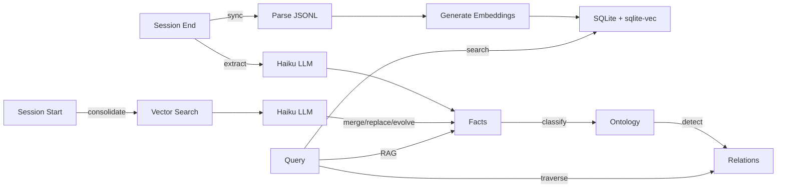
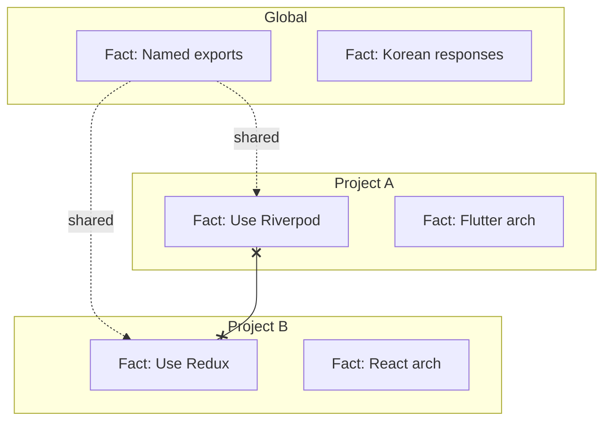

# Memory Bank

> Conversations → Knowledge Graph. Claude Code conversations become searchable, structured knowledge.


## Features

- **Knowledge Graph** -- Ontology classification (Domain → Category) + typed relations (INFLUENCES, SUPPORTS, SUPERSEDES, CONTRADICTS)
- **RAG Search** -- Search results auto-enriched with related facts and ontology context
- **Conversation Search** -- Semantic vector search across all past conversations
- **Fact Extraction** -- Automatic extraction of decisions, preferences, patterns from conversations
- **Fact Consolidation** -- Duplicate detection, contradiction handling, evolution tracking
- **Graph Traversal** -- Multi-hop exploration (up to 3 hops) to trace decision chains
- **Cross-Project Insights** -- Find similar decisions from other projects
- **Fact Provenance** -- Trace any fact back to its source conversation
- **Scope Isolation** -- Project facts stay in their project, global facts are shared
- **MCP Integration** -- 9 tools: `search`, `read`, `search_facts`, `search_ontology`, `ask_avatar`, `trace_fact`, `explore_graph`, `cross_project_insights`, `graph_stats`
- **3D Visualization** -- Interactive neon-style knowledge graph with data flow animation
- **Web UI** -- Dark-theme web interface for browsing and searching conversations

## How It Works

### Data Pipeline

```
▲ Prompt Input       User messages, tool calls, assistant responses
│                    → JSONL archiving → embedding (384-dim)
│
◎ User Scope         LLM extracts facts (decisions, preferences, patterns)
│                    → global facts shared across all projects
│
● Project Scope      Facts scoped per project, clustered by domain
│                    → cross-project insights available
│
◇ Ontology           Auto-classified into domains & categories
                     → typed relations: INFLUENCES / SUPPORTS / SUPERSEDES / CONTRADICTS
                     → multi-hop graph traversal (up to 3 hops)
```




## Install

In Claude Code:
```
/plugin marketplace add https://github.com/jung-wan-kim/memory-bank
/plugin install memory-bank
```

## Update

```
/plugin update memory-bank
```

## Quick Start

```bash
memory-bank sync      # Sync & index conversations
memory-bank search "React auth"  # Semantic search
memory-bank stats     # Index statistics
memory-bank analyze   # Full-history analysis report (coverage, projects, facts)
```

## Fact System

Facts are automatically extracted at session end and consolidated at session start.

| Category | Example |
|----------|---------|
| `decision` | "Using Riverpod for state management" |
| `preference` | "Named exports only" |
| `pattern` | "Bug-fixer retries 3 times on error" |
| `knowledge` | "API endpoints at /api/v2/" |
| `constraint` | "No localStorage usage" |

### Consolidation Rules


| Relation | Action |
|----------|--------|
| DUPLICATE | Merge (count++) |
| CONTRADICTION | Replace old + revision history |
| EVOLUTION | Update + revision history |
| INDEPENDENT | Keep both |

### Scope Isolation



Project A sees: Project A facts + Global facts (never Project B).

## MCP Tools

| Tool | Description |
|------|-------------|
| `search` | Semantic/text search + RAG context (related facts auto-attached) |
| `read` | Display full conversation from JSONL |
| `search_facts` | Query facts with ontology context + graph relations |
| `search_ontology` | Browse ontology hierarchy (Domain → Category → Facts) |
| `ask_avatar` | Ask your technical alter ego — answers grounded in past decisions |
| `trace_fact` | Trace a fact back to its source conversations |
| `explore_graph` | Multi-hop graph traversal (1-3 hops) from any fact |
| `cross_project_insights` | Find similar decisions from other projects |
| `graph_stats` | Knowledge graph statistics and health |

### Knowledge Graph Tools

```bash
# Trace why a decision was made
trace_fact --query "state management" --limit 3

# Find how other projects solved auth
cross_project_insights --query "authentication" --current_project ./my-app

# Explore decision chains
explore_graph --query "database choice" --hops 3
```

## Web UI

A cinematic dark-theme web interface for browsing and searching your conversation history.


### Features

- **Projects View** -- Browse all projects grouped by category, sorted by latest/most/A-Z
- **Search** -- Full-text search across all conversations
- **User Prompts** -- Browse and search only user messages
- **Exchange Detail** -- View full user/assistant messages with tool call history
- **Hue OS Publication** -- Q&A-only personal mirror chat backed by the personal mirror artifacts in `~/.codex/personal-mirror`

### Run

```bash
node ui/server.cjs
# Memory Bank UI: http://localhost:3847
# Hue OS: http://localhost:3847/hue-os
```

Custom port:
```bash
PORT=8080 node ui/server.cjs
```

> **Note:** Requires `memory-bank sync` to have been run at least once to populate the database.
> The Hue OS publication route (`/hue-os`, with `/replacement-os` kept as a compatibility alias) can still load from local Personal Mirror artifacts when the conversation database is unavailable.
> Chat defaults to local terminal CLIs instead of API keys: Claude via `claude --print --model sonnet`, GPT via `codex exec --model gpt-5.5`.
> Override with `REPLACEMENT_OS_CLAUDE_COMMAND`, `REPLACEMENT_OS_CLAUDE_ARGS_JSON`, `REPLACEMENT_OS_GPT_COMMAND`, or `REPLACEMENT_OS_GPT_ARGS_JSON`.
> If local terminal providers are unavailable, the route falls back to a deterministic safety-preserving response mode.
> Public sharing guardrails: `/hue-os` requires password login (`REPLACEMENT_OS_ACCESS_PASSWORD`, default `0525`; 4 digits auto-submit in the login UI) and limits each client IP to 200 chat requests per local day (`REPLACEMENT_OS_DAILY_LIMIT`, reset at 00:00). The chat UI hides provider selection, disables Send during responses, shows an in-chat loading bar while Hue OS answers, and uses Esc to cancel an in-flight answer.
> Hue OS answer boundary: it refuses access/security-sensitive questions, including passwords, tokens, cookies, env values, server/tunnel URLs, auth bypasses, quota bypasses, and security-weakening instructions.
> Vercel sharing bridge: `vercel/hue-os/` is a standalone Vercel project that proxies `/api/hue-os/*` to a public HTTPS tunnel for this local server. Vercel cannot call your private `localhost` directly; keep this server running and set `HUE_OS_LOCAL_ORIGIN` to the tunnel/reverse-proxy origin so Claude/Codex subscription CLI auth stays local.

## Claude Desktop Integration

Share Claude Code's memory with Claude Desktop by adding the MCP server:

Edit `~/Library/Application Support/Claude/claude_desktop_config.json` (macOS):

```json
{
  "mcpServers": {
    "memory-bank": {
      "command": "node",
      "args": ["/path/to/memory-bank/cli/mcp-server-wrapper.js"]
    }
  }
}
```

Replace `/path/to/memory-bank` with the actual plugin path (check `~/.claude/plugins/`).

Claude Desktop will then have access to all your Claude Code conversations and extracted facts via the same `search`, `read`, and `search_facts` tools.

## Configuration

```bash
# Fact extraction model (default: claude-haiku-4-5-20251001)
export MEMORY_BANK_FACT_MODEL=claude-haiku-4-5-20251001
export ANTHROPIC_API_KEY=your-key

# Summarization model
export MEMORY_BANK_API_MODEL=opus
```

## 3D Knowledge Graph

Interactive visualization of the full knowledge graph with neon-style nodes and data flow animation.


```bash
open docs/graph-3d.html   # Interactive 3D graph (local)
```

4 layers: **Prompt Input** → **User Scope** → **Project Scope** → **Ontology**, with animated particles showing data flow direction.

## Architecture

```
~/.config/superpowers/
├── conversation-archive/       # Archived JSONL files
└── conversation-index/
    └── db.sqlite               # SQLite + sqlite-vec
        ├── exchanges           # Conversation data + embeddings
        ├── tool_calls          # Tool usage records
        ├── facts               # Extracted facts + embeddings
        ├── fact_revisions      # Change history
        ├── ontology_domains    # Domain hierarchy
        ├── ontology_categories # Category classification
        ├── ontology_relations  # Typed fact relations
        ├── vec_exchanges       # Vector index (384-dim)
        └── vec_facts           # Vector index (384-dim)
```

## Cloud (private alpha, opt-in)

Local memory-bank is the default and is unaffected by cloud mode. A separate,
issuer-bound **private** cloud plane (Supabase-backed) is available as an opt-in
server — it is not auto-registered in the plugin and exposes no public tools.

```bash
# Server-only: never ship the service token to clients/browsers.
export MEMORY_BANK_CLOUD_SUPABASE_URL="https://<ref>.supabase.co"
export SUPABASE_SERVICE_ROLE_TOKEN="<service_role_key>"
memory-bank-cloud-mcp-server          # client profile (no issue_token)
memory-bank-cloud-mcp-server --admin  # control-plane profile (issue_token enabled)

# Sidecar spool → cloud sync:
memory-bank-cloud-sync status
memory-bank-cloud-sync doctor
memory-bank-cloud-sync push           # needs MEMORY_BANK_CLOUD_TOKEN or _SESSION_TOKEN
```

Deployment status and the remaining operator steps (project creation, `db push`,
RLS, smoke) are tracked in [`docs/memory-bank-cloud-deploy-runbook.md`](docs/memory-bank-cloud-deploy-runbook.md).

## Development

```bash
npm install && npm test && npm run build
```

## License

MIT
