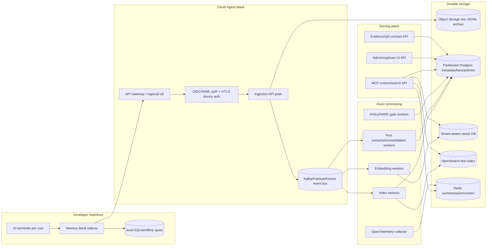

# Memory Bank Cloud Enterprise Architecture

> Goal: evolve the current local `memory-bank` CLI/MCP/SQLite plugin into a cloud service that manages memory by **company → organization → team → project → user → terminal/session**, while preserving the Loopy-Era L6/L7 requirements from `/Users/jung-wankim/.omx/specs/autoresearch-harness-loopy-era-analysis/report.md`.

## 0. One-line conclusion

Memory Bank Cloud must not be “local SQLite uploaded to a server.” It must become a **multi-tenant AI memory operating system**: tenant-isolated ingestion, archive-first storage, vector/text/fact retrieval, HARD evidence gates, scoped self-improvement, and load-tested operation for **1,000 concurrent users × 10 terminals = 10,000 active terminal sessions**.

Non-negotiable interpretation of “performance, speed, no issues”:

- **No data loss** is a hard invariant: every accepted event is durable in the raw archive before downstream processing is acknowledged complete.
- **No cross-tenant leakage** is a hard invariant: every row, object, vector, cache key, and policy decision includes tenant scope.
- **No smoke-only completion claims**: enterprise readiness requires load-test evidence, chaos/failover evidence, tenant-isolation tests, and SLO dashboards.
- **No single shared SQLite bottleneck**: local SQLite remains edge/offline cache only; cloud uses partitioned transactional storage + queues + specialized search/vector stores.

## 1. Evidence from the required report

The referenced report defines the target level as **Practical L6+ / L7-oriented**. Cloud design must therefore implement these structures:

| Report requirement | Cloud translation |
| --- | --- |
| Evidence-gated completion | Load tests, tenant-isolation tests, JSON evidence contracts, SLO dashboards, release gates. |
| Closed self-improvement | Failure signals become scoped rule proposals, validated in canaries, then kept/discarded. |
| HARD over SOFT | Policy/gate failures block release, push, tenant policy publication, and self-improve promotion. |
| Memory-grounded | Raw archive + facts + revisions + ontology + citations survive sessions and devices. |
| Fresh context, persistent state | Stateless API pods plus persistent queues/object storage/DB; no long-session dependence. |
| Scoped evolution | Personal/project/team/org/company/global memory scopes with promotion workflow. |
| Rollback/keep-discard | Versioned rules, policies, prompts, extractors, and embeddings with rollback. |
| Runtime/source drift | Versioned agent/sidecar runtime, server policy bundles, compatibility gates. |
| External signal ingestion | Optional tenant-controlled trend/signal harvesters with explicit governance. |
| Human as strategist | Admins approve irreversible org-wide policy changes; system handles normal execution/verification. |

## 2. Current Memory Bank constraints that drive the design

Current repo shape:

- `src/mcp-server.ts`: local MCP server with tools such as `search`, `read`, `search_facts`, `search_ontology`, `ask_avatar`, `trace_fact`, `explore_graph`, `cross_project_insights`, `graph_stats`.
- `src/sync.ts` + `src/indexer.ts` + `src/parser.ts`: local JSONL sync/index pipeline.
- `src/db.ts`, `src/fact-db.ts`, `src/ontology-db.ts`: local SQLite schema, `better-sqlite3`, `sqlite-vec` vector tables.
- `src/embeddings.ts`: local `@xenova/transformers` embedding generation, 384 dimensions.
- `src/fact-extractor.ts`, `src/consolidator.ts`, `src/ontology-classifier.ts`: fact extraction, consolidation, ontology relation logic.
- `ui/server.cjs`: local readonly dashboard over a local SQLite file.

Cloud blockers if copied directly:

1. `better-sqlite3` is single-node/process-local; it cannot be the shared write path for 10,000 active terminals.
2. `sqlite-vec` is useful locally, but enterprise vector search needs tenant-aware sharding, autoscaling, and online reindexing.
3. Session hooks currently assume local files and local config directories; cloud needs idempotent API ingestion, offline spooling, and replay.
4. Fact extraction/consolidation can be expensive and bursty; it must be asynchronous, quota-aware, and backpressured.
5. Local UI has no hard browser E2E. Enterprise UI/API completion cannot be claimed until hard interaction tests exist.
6. The current fact model is only `global | project`; company/org/team/user scopes must be added before cloud sharing.
7. MCP/CLI/UI are thin direct clients over the same local DB; cloud needs service boundaries, auth, quotas, and audit.
8. `ui/server.cjs` opens the local DB directly and returns JSON with permissive CORS; cloud APIs require authenticated routes, tenant filters, and rate limits.
9. The current MCP `read` behavior is file-path based; cloud must expose tenant-scoped object IDs, not arbitrary filesystem paths.
10. Embedding/search and context injection can run synchronously in-process today; cloud must precompute/cache hot context and move heavy work to queues.

Current repo evidence from the ultrawork exploration lane:

| Area | Current file evidence | Cloud implication |
| --- | --- | --- |
| Ingestion | `src/sync.ts`, `src/indexer.ts`, `src/parser.ts`, `src/embeddings.ts` | Local file sync must become sidecar → ingest API → durable queue. |
| Storage | `src/db.ts`, `src/paths.ts` | `~/.config/superpowers/.../db.sqlite` cannot be shared cloud state. |
| Fact scope | `src/types.ts`, `src/fact-db.ts` | Replace `global/project`-only visibility with personal/project/team/org/company scopes. |
| Fact lifecycle | `src/fact-extractor.ts`, `src/consolidator.ts`, `src/ontology-classifier.ts` | Extraction/consolidation should be async workers with retry, quotas, and backlog SLOs. |
| Hooks | `hooks/hooks.json`, `scripts/fact-extract-hook.js`, `scripts/fact-consolidate-hook.js` | Local best-effort hooks become cloud signals plus observability/freshness gates. |
| MCP/API | `src/mcp-server.ts`, `cli/mcp-server-wrapper.js` | Add tenant authz, object IDs, per-tenant quotas, and audit around every tool. |
| UI/API | `ui/server.cjs` | Local unauthenticated dashboard becomes admin/user web app with SSO and RBAC/ABAC. |
| Plugin install | `.claude-plugin/plugin.json` | Single-user plugin config becomes managed sidecar/runtime enrollment. |

## 3. Target tenancy and scope model

### 3.1 Hierarchy

```text
Company/Tenant
  └─ Organization
      └─ Team
          └─ Workspace/Project
              └─ Repository/Runtime profile
                  └─ User
                      └─ Terminal instance
                          └─ Session
                              └─ Exchange / tool call / event / fact / evidence
```

### 3.2 Required IDs on every object

Every persisted object must include:

```text
tenant_id          # company/customer hard isolation boundary
org_id             # department/business unit
team_id            # team-level sharing boundary
project_id         # repo/workspace/project memory boundary
user_id            # personal memory owner
terminal_id        # one of the user’s active terminal streams
session_id         # conversation/session stream
source_agent       # claude-code | codex | opencode | custom
source_version     # sidecar/plugin/runtime version
event_seq          # monotonic per terminal/session for idempotency
schema_version     # event contract version
```

### 3.3 Memory scopes

| Scope | Visibility | Promotion rule |
| --- | --- | --- |
| `personal` | user only | user opts in or team policy allows anonymized promotion |
| `project` | project members | project maintainer approval or repeated evidence from project sessions |
| `team` | team members | team admin approval + no secret/PII findings |
| `org` | org members | org knowledge steward approval + canary validation |
| `company` | tenant-wide | security/governance approval + rollback plan |
| `global_template` | product/vendor maintained | never includes tenant data; only generic patterns |

**Hard rule:** user private facts never auto-promote to team/org/company without a policy event and audit record.

## 4. Reference cloud architecture



### 4.1 Edge sidecar

Responsibilities:

- Capture terminal/session events from Claude Code/Codex/other agents.
- Redact secrets before upload using local rules plus server-pushed policy bundles.
- Assign `terminal_id`, `session_id`, and monotonic `event_seq`.
- Persist to local spool first, then upload in compressed batches.
- Retry with exponential backoff and idempotency keys.
- Maintain small local cache for offline search/context when cloud is unavailable.

The sidecar must never block local developer work because cloud indexing is delayed; it only blocks when a configured HARD gate says the action is unsafe.

### 4.2 Ingestion plane

- Stateless Node/Go/Rust ingestion service behind regional load balancers.
- AuthN: SSO OIDC/SAML for user identity, mTLS or signed device tokens for sidecars.
- Idempotency: unique key `(tenant_id, terminal_id, session_id, event_seq)`.
- Durable ack stages:
  1. `received` after auth/schema validation.
  2. `archived` after raw object write.
  3. `queued` after event bus publish.
  4. `indexed` after async search/vector/text indexing.

For no data loss, sidecar deletes local spool entries only after at least `archived + queued` ack.

### 4.3 Event bus

Use Kafka-compatible, Kinesis, Pub/Sub, or Redpanda-style durable streams. Topic partitioning key:

```text
hash(tenant_id, project_id, session_id)
```

Rationale:

- Keeps per-session ordering within a partition.
- Allows consumer groups to scale with partitions.
- Avoids one hot tenant blocking every tenant.

Minimum topics:

| Topic | Purpose | Retention |
| --- | --- | --- |
| `raw-session-events` | exchanges, tool calls, terminal events | 3-7 days replay |
| `fact-candidates` | post-parse fact extraction candidates | 7-30 days |
| `embedding-jobs` | text chunks needing embeddings | until processed |
| `policy-signals` | gate failures, user complaints, fix commits | 30-90 days |
| `audit-events` | immutable admin/security events | long-term archive |

### 4.4 Storage choices

| Data | Primary store | Why |
| --- | --- | --- |
| Raw conversations/events | Object storage | Cheapest durable archive; replayable; compliance retention. |
| Metadata, tenants, policies, facts, revisions | Partitioned Postgres | Strong relational constraints, transactions, joins, auditability. |
| Vector embeddings | Qdrant/Weaviate/Milvus/Pinecone or pgvector for smaller installs | Tenant-aware vector search and online scaling. |
| Text search | OpenSearch/Elasticsearch | Full-text search, highlighting, filters, observability-friendly. |
| Hot context cache | Redis Cluster | Low-latency project/team/user top facts and recent session context. |
| Audit ledger | Object storage + append-only DB table | Compliance, incident investigation, tamper resistance. |

Recommended default:

- **Pool model** for small/medium tenants: shared clusters with hard `tenant_id` partitioning and policy enforcement.
- **Silo model** for regulated/large tenants: dedicated DB/vector/search namespaces or clusters.
- **Hybrid promotion**: start tenants in pool; promote high-volume tenants to dedicated shards/clusters when SLO or compliance requires.

## 5. Core data model

### 5.1 Control-plane tables

```sql
tenants(id, name, plan, region, kms_key_id, isolation_mode, created_at)
orgs(id, tenant_id, name, parent_org_id)
teams(id, tenant_id, org_id, name)
projects(id, tenant_id, org_id, team_id, repo_url, slug, visibility)
users(id, tenant_id, external_subject, email, display_name, status)
memberships(tenant_id, scope_type, scope_id, user_id, role)
terminals(id, tenant_id, user_id, device_id, hostname_hash, runtime_version)
sessions(id, tenant_id, user_id, project_id, terminal_id, started_at, ended_at)
```

### 5.2 Memory-plane tables

```sql
exchanges(
  tenant_id, org_id, team_id, project_id, user_id, terminal_id, session_id,
  exchange_id, event_seq_start, event_seq_end, timestamp,
  user_message_ref, assistant_message_ref, archive_object_key,
  source_agent, source_version, embedding_id, visibility_scope
)

tool_calls(
  tenant_id, project_id, session_id, exchange_id,
  tool_call_id, tool_name, input_ref, output_ref, is_error, timestamp
)

facts(
  tenant_id, scope_type, scope_id, fact_id, fact, category,
  confidence, source_exchange_ids, embedding_id,
  created_at, updated_at, active, promoted_from_scope, policy_version
)

fact_revisions(
  tenant_id, fact_id, revision_id, previous_fact, new_fact,
  relation, reason, source_exchange_id, created_at
)

ontology_edges(
  tenant_id, source_fact_id, relation_type, target_fact_id,
  reasoning_ref, created_at
)
```

Partition strategy:

- Postgres parent tables partitioned by `tenant_id` hash and time range for large append-only tables.
- Hot append tables (`exchanges`, `tool_calls`, `audit_events`) use time partitions to make retention/deletion cheap.
- Every index used by request paths starts with `tenant_id` and the next filter key (`project_id`, `team_id`, `user_id`, or `session_id`).

## 6. Performance model for 1,000 users × 10 terminals

### 6.1 Concurrency target

```text
Users:             1,000
Terminals/user:    10
Active terminals:  10,000
```

A terminal is not always producing LLM turns. Capacity planning separates **event ingest** from **search/context reads** and **expensive async extraction**.

### 6.2 Baseline assumptions

| Workload | Sustained target | Burst target | Notes |
| --- | ---: | ---: | --- |
| Terminal heartbeat/status events | 10,000/min | 10,000/sec for reconnect storm | Cheap, cacheable, low retention. |
| Session/exchange events | 2,000/sec | 10,000/sec | Based on 20% of terminals active at once; burst covers spikes. |
| Tool-call events | 5,000/sec | 25,000/sec | Tools can be noisier than assistant turns. |
| Context/search reads | 3,000 QPS | 15,000 QPS | IDE/terminal context injection plus user searches. |
| Embedding jobs | 2,000 chunks/sec | queue-backed | Async; queue lag SLO matters more than inline latency. |
| Fact extraction jobs | 100-500/sec equivalent | queue-backed | LLM/API limited; batch and prioritize. |

### 6.3 SLO targets

| Operation | SLO |
| --- | --- |
| Ingest API auth/schema validation | p95 < 50 ms, p99 < 150 ms |
| Durable ingest ack (`archived + queued`) | p95 < 250 ms, p99 < 1 s |
| Cached context lookup | p95 < 100 ms, p99 < 250 ms |
| Hybrid text/vector search | p95 < 500 ms, p99 < 1.5 s |
| New event visible in text search | p95 < 5 s |
| New event visible in vector search | p95 < 30 s |
| Fact extraction/consolidation visibility | p95 < 2 min for normal priority |
| Tenant policy update propagation | p95 < 30 s |
| Recovery point objective | 0 accepted events lost |
| Recovery time objective per region cell | < 15 min for failover; < 1 min for pod/node failures |

### 6.4 Scaling rules

- API pods scale on request rate, latency, CPU, and event-loop saturation.
- Worker pods scale on queue lag, messages/sec, and downstream throttle signals.
- Embedding workers use separate CPU/GPU node pools; never starve ingest/API nodes.
- Vector/text search clusters scale by tenant volume, shard size, and p95 latency.
- Large tenants are promoted from pooled shards to dedicated shards/clusters when they exceed:
  - 20% of pooled cluster QPS,
  - 20% of pooled vector count/storage,
  - p95 search SLO degradation for other tenants,
  - compliance isolation requirements.

### 6.5 Backpressure policy

When overloaded:

1. Never drop accepted events.
2. Preserve raw archive writes and queue publish first.
3. Defer embeddings, fact extraction, summarization, and graph updates.
4. Serve stale cached context with `staleness_ms` metadata.
5. Throttle low-priority tenants/features before interactive context injection.
6. Alert when queue lag threatens visibility SLO.

## 7. Company/org/team management features

### 7.1 Admin surfaces

| Surface | Capability |
| --- | --- |
| Company admin | tenant settings, SSO/SCIM, KMS key, retention, regions, audit exports. |
| Org admin | org policies, data boundaries, allowed project/team sharing. |
| Team admin | team memory scopes, project membership, promotion approvals. |
| Project maintainer | project-specific facts/rules/hooks, source repo mapping. |
| User | personal memory, private facts, terminal/device list, opt-in promotion. |
| Security/compliance | audit logs, DLP findings, access reviews, legal hold/deletion. |

### 7.2 RBAC + ABAC

RBAC alone is not enough. Authorization must combine:

- Role: owner/admin/member/viewer/security-auditor.
- Scope: tenant/org/team/project/user.
- Attributes: source repo, sensitivity label, fact category, region, device trust, policy version.
- Decision audit: every denied/allowed cross-scope read is logged.

Hard rule: access checks run at the data access layer, not only at API route handlers.

## 8. Loopy-Era cloud runtime contract

### 8.1 Signal schema

```json
{
  "contract_type": "hard",
  "signal_id": "sig_...",
  "tenant_id": "...",
  "scope_type": "project|team|org|company|personal",
  "scope_id": "...",
  "source": "qa_failure|user_complaint|fix_commit|policy_violation|trend_signal",
  "severity": "info|warning|blocker|critical",
  "evidence_refs": ["s3://...", "exchange_id", "qa_report_id"],
  "created_at": "..."
}
```

### 8.2 Self-improve lifecycle

```text
signal captured
→ proposal generated
→ scope classifier decides personal/project/team/org/company
→ canary policy/rule bundle built
→ replay tests + tenant-isolation tests + load smoke
→ admin approval if irreversible or broad scope
→ publish versioned bundle
→ monitor metrics
→ keep if score improves, discard/rollback if score regresses
```

### 8.3 HARD gates

Enterprise HARD gates:

- Tenant isolation test must pass before deploy.
- Load test must pass before raising tenant concurrency limits.
- Policy bundle cannot publish without signed evidence contract.
- No org/company memory promotion without DLP/secret scan + approval.
- No sidecar runtime rollout without compatibility test against server schema.
- No completion claim when qa-cycle marker is `BLOCKED`.

## 9. Security, privacy, and compliance

Minimum controls:

- SSO/OIDC/SAML, SCIM provisioning, MFA enforcement through IdP.
- Per-tenant encryption keys or envelope encryption with tenant key references.
- Secret/PII detection at edge and cloud ingest.
- Field-level sensitivity labels for messages, tool inputs, outputs, facts, embeddings.
- Tenant-scoped caches; cache keys include `tenant_id` and scope.
- Audit log for every admin action, memory promotion, policy publication, and cross-scope read.
- Retention/deletion workflows: raw archive, metadata rows, search docs, vectors, caches, and derived facts all get deletion jobs.
- Break-glass access with approval, time bound, and immutable audit trail.

## 10. Observability and operations

Instrumentation:

- OpenTelemetry traces across sidecar → ingest → queue → workers → search/vector/DB.
- Metrics by tenant, org, team, project, region, service, and priority class.
- Structured logs with tenant metadata but no secret payloads.

Required dashboards:

- Ingest QPS, latency, error rate, ack-stage breakdown.
- Queue lag by topic/tenant/priority.
- Text/vector search p50/p95/p99.
- Embedding/fact extraction throughput and backlog.
- Cross-tenant access denials and policy violations.
- Cache hit rate and staleness.
- Sidecar upload lag and offline spool size.
- SLO burn-rate alerts.

## 11. Load-test and verification gates

### 11.1 Required load tests

| Test | Command shape | Pass condition |
| --- | --- | --- |
| 10k terminal ingest | `k6 run cloud/load/10k-terminals-ingest.js` | 10,000 active terminal streams; p95 durable ack < 250 ms; 0 accepted-event loss. |
| 15k QPS context/search | `k6 run cloud/load/context-search.js` | p95 cached context < 100 ms; p95 hybrid search < 500 ms. |
| Burst/reconnect storm | `k6 run cloud/load/reconnect-storm.js` | 10k reconnect/sec tolerated; no auth/queue collapse. |
| Queue lag soak | `k6 run cloud/load/24h-soak.js` | 24h run; queue lag within SLO; no memory leaks. |
| Tenant isolation | `pytest cloud/tests/test_tenant_isolation.py` | zero cross-tenant reads/writes/cache/vector hits. |
| Failover chaos | `litmuschaos`/`chaos-mesh` or managed equivalent | pod/node/AZ failures maintain RPO/RTO. |
| Policy rollback | `pytest cloud/tests/test_policy_rollback.py` | bad rule bundle rolls back automatically and audit is retained. |

### 11.2 Evidence contract

A release is not enterprise-ready until it writes:

```text
.cloud-evidence/load-10k-terminals.json
.cloud-evidence/search-qps.json
.cloud-evidence/tenant-isolation.json
.cloud-evidence/failover.json
.cloud-evidence/security-scan.json
.cloud-evidence/release-gate.json
```

Each file must include:

```json
{
  "contract_type": "hard",
  "status": "pass",
  "scenario_id": "...",
  "started_at": "...",
  "ended_at": "...",
  "target": { "users": 1000, "terminals_per_user": 10 },
  "slo_results": { "p95_ms": 0, "error_rate": 0 },
  "blocker_count": 0,
  "artifacts": []
}
```

## 12. Migration plan from current repo

### Phase 0 — preserve local compatibility

- Keep current CLI/MCP local behavior.
- Add cloud sidecar mode behind feature flag.
- Local SQLite remains offline cache/spool.
- No user workflow breakage.

### Phase 1 — cloud ingestion mirror

- Implement tenant/project/user identity envelope.
- Upload raw events to cloud while still indexing locally.
- Validate idempotent replay and raw archive durability.

### Phase 2 — cloud search/context read path

- Add cloud MCP endpoint for `search`, `read`, `search_facts` equivalents.
- Hybrid local/cloud fallback.
- Text/vector search split with tenant filters.

### Phase 3 — fact/ontology/self-improve cloud pipeline

- Move extraction/consolidation to async workers.
- Add promotion workflow for project/team/org facts.
- Add Loopy-Era signal/proposal/keep-discard lifecycle.

### Phase 4 — enterprise admin and governance

- SSO/SCIM, RBAC/ABAC, audit exports, retention policies.
- Company/org/team/project dashboards.
- Policy bundle rollout/rollback.

### Phase 5 — scale and regionalization

- 10k terminal load gates.
- Tenant promotion to dedicated shards/cells.
- Multi-region DR and data residency.

## 13. Implementation priorities

P0 must be built first:

1. Cloud event envelope schema.
2. Sidecar offline spool + idempotent upload.
3. Ingest API + raw archive + durable queue.
4. Tenant/org/team/project/user schema.
5. Authorization middleware + data-layer tenant checks.
6. Basic cloud search/read API using text search and raw archive.
7. Load-test harness for 10,000 terminal streams.
8. Tenant isolation tests.

P1:

1. Vector service and embedding workers.
2. Fact extraction/consolidation workers.
3. Context cache service.
4. Admin UI/API for teams/projects.
5. Evidence contract service.

P2:

1. Scoped self-improve loop.
2. Policy bundle canary/rollback.
3. Enterprise audit/compliance exports.
4. Dedicated tenant shard/cell promotion.

## 14. Risk register

| Risk | Severity | Control |
| --- | --- | --- |
| Cross-tenant data leakage | Critical | tenant_id everywhere, data-layer auth, isolation tests, cache/vector filters. |
| Queue backlog delays memory freshness | High | priority queues, autoscaling workers, stale context metadata. |
| Vector DB filter performance degrades with many tenants | High | payload indexes, tenant sharding, tenant promotion to dedicated shards. |
| LLM extraction cost/rate limit explosion | High | async batching, quotas, priority, summarization tiers, tenant budgets. |
| Sidecar loses events offline | Critical | local durable spool, replay, idempotency, ack-stage protocol. |
| Admin publishes bad org-wide rule | High | canary, evidence contract, approval, automatic rollback. |
| Search latency misses SLO | High | cache top facts, precompute project context, shard by tenant/project, load gates. |
| Compliance deletion misses derived data | Critical | deletion DAG across archive/DB/search/vector/cache/facts, evidence file. |

## 15. Provider-neutral deployment blueprint

Default deployment unit: **regional cell**.

A cell contains:

- Kubernetes/ECS/GKE/AKS compute cluster.
- Ingest/API autoscaling node pool.
- Worker node pools for indexing/embeddings/facts.
- Managed Postgres or compatible distributed Postgres.
- Managed Kafka/Kinesis/Pub/Sub.
- Object storage bucket with lifecycle policies.
- Vector DB cluster.
- OpenSearch cluster.
- Redis cluster.
- OpenTelemetry collector and metrics/log backend.

Cell routing:

- New tenants assigned to a home region/cell.
- Large tenants can be moved to dedicated cells.
- Cross-region reads are avoided unless explicitly configured.
- Disaster recovery replays raw archive + queue checkpoints into a warm standby cell.

## 16. Official reference anchors

This design uses the following current official/primary references as anchors:

| Reference | Design use | URL |
| --- | --- | --- |
| AWS Well-Architected Framework | Reliability/performance/security/operations checklist. | https://docs.aws.amazon.com/wellarchitected/latest/framework/welcome.html |
| AWS SaaS tenant isolation strategies | Pool/silo/hybrid tenant isolation model. | https://docs.aws.amazon.com/whitepapers/latest/saas-tenant-isolation-strategies/saas-tenant-isolation-strategies.html |
| Kubernetes autoscaling | HPA/autoscaling model for API and worker pods. | https://kubernetes.io/docs/concepts/workloads/autoscaling/ |
| PostgreSQL declarative partitioning | Tenant/time partitioned relational metadata and retention. | https://www.postgresql.org/docs/current/ddl-partitioning.html |
| Apache Kafka introduction | Partition/consumer-group scaling and per-partition ordering. | https://kafka.apache.org/20/getting-started/introduction/ |
| Qdrant multitenancy | Payload partitioning and tenant promotion for vector data. | https://qdrant.tech/documentation/guides/multitenancy/ |
| Redis Cluster specification | Scalable/high-availability cache topology. | https://redis.io/docs/latest/operate/oss_and_stack/reference/cluster-spec/ |
| OpenTelemetry documentation | Vendor-neutral traces, metrics, and logs. | https://opentelemetry.io/docs/ |
| OWASP Authorization Cheat Sheet | Robust contextual authorization and testing expectations. | https://cheatsheetseries.owasp.org/cheatsheets/Authorization_Cheat_Sheet.html |
| OWASP Multi-Tenant Security Cheat Sheet | Data-layer authorization and tenant-specific security controls. | https://cheatsheetseries.owasp.org/cheatsheets/Multi_Tenant_Security_Cheat_Sheet.html |

## 17. Completion checklist for this design

- [x] Uses the report’s L6/L7 structure: evidence, HARD gates, scoped evolution, rollback, self-improve.
- [x] Converts Memory Bank from local SQLite/plugin assumptions to cloud architecture.
- [x] Defines company/org/team/project/user/terminal/session hierarchy.
- [x] Designs for 1,000 users × 10 terminals = 10,000 active terminals.
- [x] Provides performance assumptions, SLOs, backpressure, and autoscaling rules.
- [x] Includes security, tenant isolation, audit, and governance.
- [x] Includes load-test/evidence gates instead of claiming performance by design only.
- [x] Identifies current blockers and migration phases.

